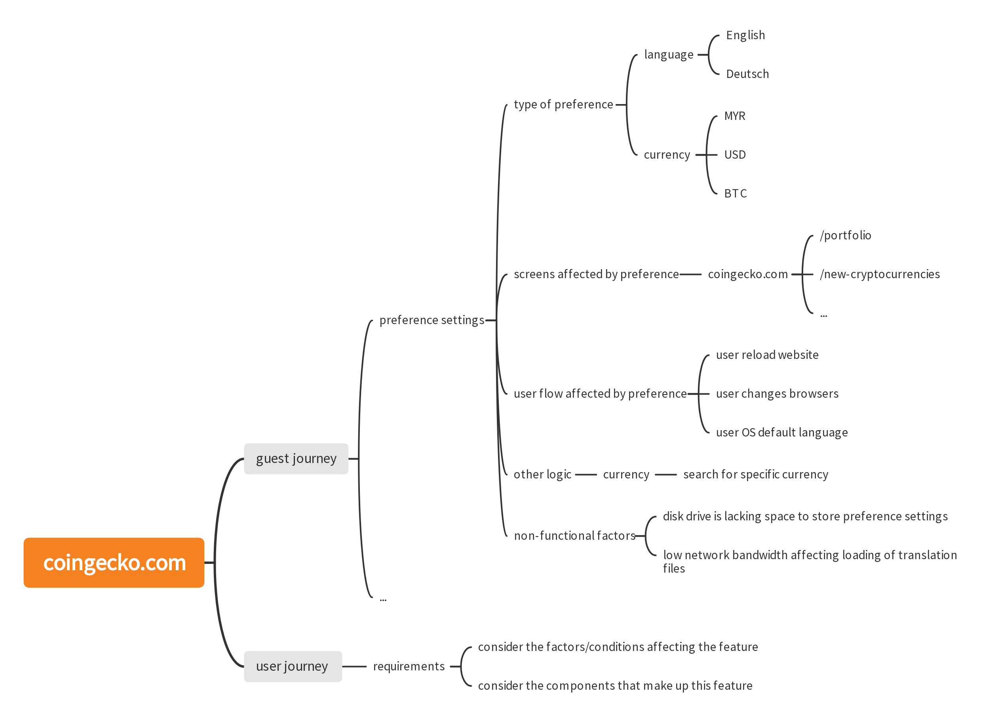

# Software Test Engineer - Coingecko Web App

# CoinGecko Software Test Engineer - Basic User Journey Asssessment

You are tasked to develop a simple Test Plan for a basic user journey on the Coingecko web app: [https://www.coingecko.com](https://www.coingecko.com)

## Product Specifications

## 1. Guest journey

1. An unauthenticated user ("Guest") is able to update preferred language and currency on the header nav.
2. A Guest is able to access price data for [Cryptocurrencies](https://www.coingecko.com/ ), [Categories](https://www.coingecko.com/en/categories/analytics) and [Exchanges](https://www.coingecko.com/en/exchanges)
3. A Guest is able to perform a search for a given cryptocurrency or token e.g. BTC
4. A Guest is required to Sign Up to create a [Portfolio](https://www.coingecko.com/en/portfolio)

## 2. User Signup and Portfolio

1. A Guest is required to provide Email and Password to Sign Up. 
2. An authenticated user (_"User"_) is able to access a default Portfolio ("My Portfolio")
3. A User is able to add new coins to their portfolio
4. A User is able to Add Transaction for BTC to their portfolio
5. A User is able to create multiple Portfolios
6. A User is able to repeat steps 3-4 for new Portfolios

## Scoring Guide

Develop a **Test Plan** for the above product specifications.
Your Test Plan should include **Test Scenarios**, **Test Steps/Cases**, a **Mind Map** and their corresponding pass/fail criteria.

All submissions will be evaluated based on the following criteria: 

- Structure and organization of the Test Plan.
- Conciseness, readability, accuracy and adaptibility to future changes. 
- Test coverage for happy path and edge-case scenarios in critical application components.
- Samples of failure scenarios and relevant details e.g. build environment version and steps to reproduce.
- Automation code will be assess on selectors strategies, code structure and readability, assertions, setup and teardown, other relevant utilities.

Example of a mindmap: \

#### Extra Credit:

L3 and above candidates will additionally be evaluated based on the following scope:
 
- Automated regression testing of _either_ (1) Guest or (2) User journeys only. You may implement this with automated functional testing frameworks such as **Capybara**, **Selenium** etc.  

## Submission Guide

- Your submission should include the Test Plan and a completed test execution. You may use the provided spreadsheet as a starting point. 
- You can use [gitmind.com](https://gitmind.com/) as a free mindmapping software.
- You should fork this repository into a private repository, and upload the (1) Spreadsheet, (2) Mindmap, and (3) Automation Code (if any) into your fork. Invite the users in the [Reviewers](https://gitlab.com/groups/coingecko-dev-test/-/group_members) group with the **Reporter** role.
- We do not expect candidates that meet the baseline to take more than 2 weeks to complete the assignment. Do correspond with the Talent Acquisition team for extensions. 
- Your submission should give us a overview of your depth and breadth of working experience to understand how to help you smoothly onboard onto the team.
- Your submission will be used as a **foundation for the next/final round** of interview. 
- You may use our [stackshare.io](https://stackshare.io/coingecko) profile as a point of reference.
